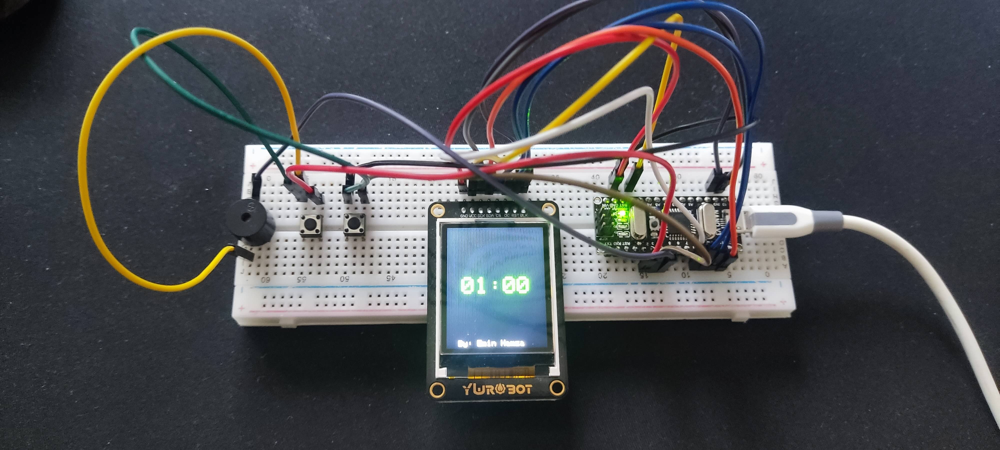

# Arduino Countdown Timer: Not Your Grandma's Egg Timer 🥚⏰


## What's This Thing?

Ever thought to yourself, "I wish I had a tiny robot that could count down time and then celebrate like it's 1999 when it hits zero"? No? Just me? Well, I built it anyway. This little gizmo uses an Arduino Nano V3 to do just that, with a screen that shows time like it's running out (because it is) and a piezo buzzer that throws a mini rave when the countdown reaches zero.

## Features That'll Knock Your Socks Off (or at least slightly displace them)

- Adjustable countdown time, because not everything is a minute-long.
- Visual alert on a TFT display so you can watch time slip away in high definition.
- A melody from the piezo buzzer that’s more pleasant than your morning alarm.
- Pause/Resume functionality, for when you need to take a breather from all the excitement.
- A button to add more time, because procrastination.

## Getting Started (Let's Get This Party Started 🎉)

### Stuff You Need

- An Arduino Nano V3 (the brain)
- ST7735 TFT Display (the eyes)
- Piezo Buzzer (the voice)
- Pushbuttons (the fingers)
- Resistors (just because)

### Hooking It All Up

#### Doodle of Connections

```
Arduino Nano V3 -> ST7735 TFT Display
- D10 -> CS (Chip Select, not Counter-Strike)
- D9  -> RST (Reset, not Rest)
- D8  -> DC (Data/Command, not Washington D.C.)
- MOSI (D11) and SCK (D13) for SPI magic

Arduino Nano V3 -> Piezo Buzzer
- D4 -> Positive Vibes
- GND -> Negative Vibes

Arduino Nano V3 -> Pushbuttons
- D2 -> More Time Button (Because why not?)
- D3 -> Start/Pause Button (Schrodinger's Button)
```

## How To Use (or How To Make Time Fly)

Upload the code, press the buttons, watch the countdown, and enjoy the show. It’s that simple. Or is it? Yes, it is.

## Eye Candy (Because Reading is Hard)


More visual stimuli:
- 
- 

### Moving Pictures (Because Still Images Are So 2020)

- [Epic Countdown Demo](demo.mp4)

## Contributing

Got an idea to make this even cooler? Fork it, tweak it, push it. Let's make timekeeping fun again.

## License

This project is as free as your time on a weekend. Do what you want with it. Just don't sell it to a supervillain.
